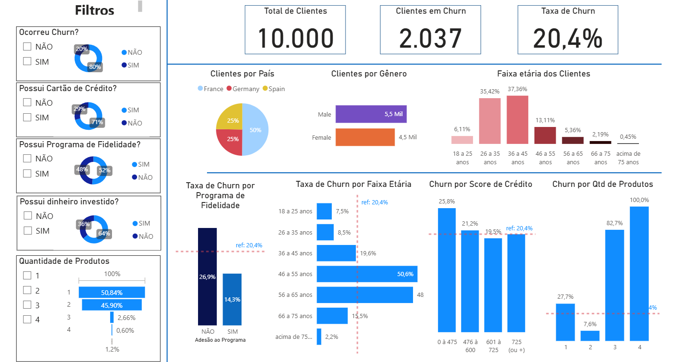

# Análise de Churn – Dashboard Power BI

## Problema de Negócio
Entender melhor o perfil dos clientes e identificar fatores associados ao churn (abandono), com o objetivo de apoiar estratégias de retenção e reduzir a taxa de cancelamento.

## Objetivo do Dashboard
- Analisar o perfil demográfico e financeiro dos clientes.
- Identificar variáveis associadas à maior probabilidade de churn.
- Apoiar decisões estratégicas para retenção.
- Fornecer visão executiva e visão analítica detalhada.

## Principais Métricas

### Página Principal
- Total de Clientes: 10.000
- Clientes em Churn: 2.037
- Taxa de Churn: 20,4%
- Comparações visuais entre grupos demográficos e financeiros.

### Página Analítica
Taxa de churn segmentada por:
- País
- Gênero
- Faixa etária
- Programa de fidelidade
- Cartão de crédito
- Dinheiro investido
- Score de crédito
- Quantidade de produtos
- Tempo como cliente
- Salário estimado

## Principais Conclusões da Análise

### Público Prioritário para Retenção
Foram identificados grupos com maior propensão ao churn:
- Clientes com idade acima de 45 anos
- Clientes que não participam do programa de fidelidade
- Clientes com baixo score de crédito
- Clientes da Alemanha
- Clientes do gênero feminino
- Clientes que possuem dinheiro investido
- Clientes com muitos produtos (possível efeito de base pequena)

## Insights Estratégicos
- O programa de fidelidade reduz o churn quase pela metade.
- A faixa etária de 46–65 anos concentra maior risco.
- Clientes com score de crédito baixo apresentam maior tendência de saída.
- A Alemanha apresenta churn superior à média global.
- Existe diferença de churn entre gêneros.
- Clientes com múltiplos produtos podem indicar risco específico ou possível distorção estatística.

## Recomendações Estratégicas

### 1. Fortalecer o Programa de Fidelidade
Clientes participantes apresentam churn significativamente menor.

### 2. Estratégia para Clientes de 46–65 anos
Criar benefícios personalizados para essa faixa etária.

### 3. Abordagem para Clientes com Baixo Score de Crédito
Desenvolver política de relacionamento e ofertas específicas para esse grupo.

### 4. Campanhas Regionais (Alemanha)
Implementar ações direcionadas para reduzir churn na região.

### 5. Avaliar Diferença por Gênero
Investigar se produtos e atendimento estão equilibrados.

## Design do Dashboard
- KPIs no topo para visão executiva rápida.
- Gráficos de rosca para proporções demográficas.
- Linha vermelha tracejada indicando churn médio (20,4%) como referência.
- Barras mais altas indicam maior risco relativo.
- Uso de cores consistentes para facilitar comparação entre grupos.

## Estrutura Visual

### Visão Geral

  

## Ferramentas Utilizadas
- Power BI
- Modelagem de Dados (Star Schema)
- Medidas DAX
- Análise Exploratória de Dados

## Valor Gerado
O dashboard permite identificar grupos prioritários para retenção e direcionar estratégias de forma mais eficiente, aumentando o potencial de redução da taxa de churn.
